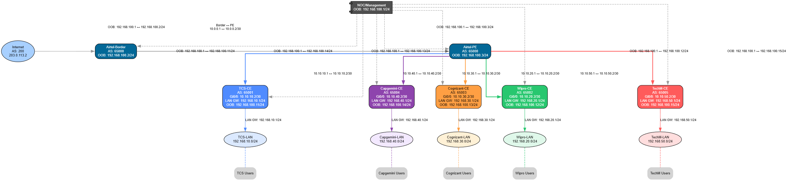

<p align="center">
    
</p>

<h2 align="center">ISP Advanced Project (Gurdepinder Dhillon Sir)</h2>

---

## 📝 About This Project

Welcome to my **ISP Advanced Project**, guided by **Gurdepinder Dhillon Sir**.  
This project demonstrates a complete MPLS Layer 3 VPN implementation simulating an ISP network with multiple enterprise customers. The lab features MPLS core infrastructure, VRFs for customer isolation, BGP routing, and out-of-band management.



---

## 🧠 What's Inside?

- 🔧 Advanced Labs
- 📜 Pre-configured startup-config files
- 📚 Lab-by-lab configuration guides
- 🖼️ Screenshots of working topologies
- 🛠️ Real-world scenarios (ISP, MPLS, OSPF, BGP, VLAN, STP, etc.)
- 🧪 Troubleshooting labs

---

## 🚀 Who Can Use This?

- Students of **Gurdepinder Dhillon Sir (NDS)**
- CCNA/CCNP Aspirants **NG**
- Self-learners and Network Engineers
- Anyone building a home lab using GNS3

---

## 🌐 Network Topology


*Complete MPLS L3VPN network diagram showing core infrastructure and customer connections*

---

## 🏢 Network Architecture

### 🔧 Core Infrastructure
- **Airtel-Border Router**: Internet edge with eBGP to upstream
- **Airtel-PE Router**: Provider Edge with MPLS and VRFs
- **MPLS Core**: Label switching for traffic engineering

### 👥 Enterprise Customers
- **TCS**: AS 65001 (192.168.10.0/24)
- **Wipro**: AS 65002 (192.168.20.0/24) 
- **Cognizant**: AS 65003 (192.168.30.0/24)
- **Capgemini**: AS 65004 (192.168.40.0/24)
- **TechM**: AS 65005 (192.168.50.0/24)

### 🛡️ Management Network
- **NOC Server**: Out-of-band management (192.168.100.0/24)
- **OOB Connectivity**: All devices have management interfaces

---

## 🌐 IP Addressing Plan

| Link | Device A | IP A | Device B | IP B | Subnet | Purpose |
|------|----------|------|----------|------|--------|---------|
| Internet ↔ Border | Internet | 203.0.113.2 | Airtel-Border | 203.0.113.1 | /30 | Internet Uplink |
| Border ↔ PE | Airtel-Border | 10.0.0.1 | Airtel-PE | 10.0.0.2 | /30 | Core Link |
| PE ↔ TCS-CE | Airtel-PE | 10.10.10.1 | TCS-CE | 10.10.10.2 | /30 | TCS VRF |
| PE ↔ Wipro-CE | Airtel-PE | 10.10.20.1 | Wipro-CE | 10.10.20.2 | /30 | Wipro VRF |
| PE ↔ Cognizant-CE | Airtel-PE | 10.10.30.1 | Cognizant-CE | 10.10.30.2 | /30 | Cognizant VRF |
| PE ↔ Capgemini-CE | Airtel-PE | 10.10.40.1 | Capgemini-CE | 10.10.40.2 | /30 | Capgemini VRF |
| PE ↔ TechM-CE | Airtel-PE | 10.10.50.1 | TechM-CE | 10.10.50.2 | /30 | TechM VRF |
| OOB Management | NOC | 192.168.100.1 | All Devices | 192.168.100.x | /24 | Management Network |

---

## 🛠️ Complete Step-by-Step Configuration

### 🔧 Airtel-Border Router Configuration

```
hostname Airtel-Border
!
interface GigabitEthernet0/0
 description To-Internet-UPLINK
 ip address 203.0.113.1 255.255.255.252
 no shutdown
!
interface GigabitEthernet0/1
 description To-Airtel-PE
 ip address 10.0.0.1 255.255.255.252
 no shutdown
!
interface GigabitEthernet0/2
 description OOB-to-NOC
 ip address 192.168.100.2 255.255.255.0
 no shutdown
!
ip route 0.0.0.0 0.0.0.0 203.0.113.2
!
router bgp 65000
 bgp router-id 203.0.113.1
 neighbor 203.0.113.2 remote-as 200
 neighbor 10.0.0.2 remote-as 65000
 !
 address-family ipv4
  neighbor 203.0.113.2 activate
  neighbor 10.0.0.2 activate
 exit-address-family
 address-family vpnv4
  neighbor 10.0.0.2 activate
 exit-address-family
!
```
### 🔧 Airtel-PE Router Configuration
```
hostname Airtel-PE
!
interface GigabitEthernet0/0
 description To-Airtel-Border
 ip address 10.0.0.2 255.255.255.252
 no shutdown
!
interface GigabitEthernet0/1
 description To-TCS-CE
 ip address 10.10.10.1 255.255.255.252
 no shutdown
!
interface GigabitEthernet0/2
 description To-Wipro-CE
 ip address 10.10.20.1 255.255.255.252
 no shutdown
!
interface GigabitEthernet0/3
 description To-Cognizant-CE
 ip address 10.10.30.1 255.255.255.252
 no shutdown
!
interface GigabitEthernet0/4
 description To-Capgemini-CE
 ip address 10.10.40.1 255.255.255.252
 no shutdown
!
interface GigabitEthernet0/5
 description To-TechM-CE
 ip address 10.10.50.1 255.255.255.252
 no shutdown
!
interface GigabitEthernet0/10
 description OOB-to-NOC
 ip address 192.168.100.3 255.255.255.0
 no shutdown
!
mpls ip
mpls label protocol ldp
!
router ldp
 interface GigabitEthernet0/0
 interface GigabitEthernet0/1
 interface GigabitEthernet0/2
 interface GigabitEthernet0/3
 interface GigabitEthernet0/4
 interface GigabitEthernet0/5
!
router ospf 1
 router-id 10.0.0.2
 network 10.0.0.0 0.0.0.3 area 0
 network 10.10.10.0 0.0.0.3 area 0
 network 10.10.20.0 0.0.0.3 area 0
 network 10.10.30.0 0.0.0.3 area 0
 network 10.10.40.0 0.0.0.3 area 0
 network 10.10.50.0 0.0.0.3 area 0
!
router bgp 65000
 bgp router-id 10.0.0.2
 neighbor 10.0.0.1 remote-as 65000
 neighbor 10.0.0.1 update-source GigabitEthernet0/0
 address-family ipv4
  neighbor 10.0.0.1 activate
 exit-address-family
 address-family vpnv4
  neighbor 10.0.0.1 activate
 exit-address-family
!
ip vrf TCS
 rd 65000:100
 route-target export 65000:100
 route-target import 65000:100
!
ip vrf WIPRO
 rd 65000:101
 route-target export 65000:101
 route-target import 65000:101
!
ip vrf COGNIZANT
 rd 65000:102
 route-target export 65000:102
 route-target import 65000:102
!
ip vrf CAPGEMINI
 rd 65000:103
 route-target export 65000:103
 route-target import 65000:103
!
ip vrf TECHM
 rd 65000:104
 route-target export 65000:104
 route-target import 65000:104
!
interface GigabitEthernet0/1
 vrf forwarding TCS
 ip address 10.10.10.1 255.255.255.252
!
interface GigabitEthernet0/2
 vrf forwarding WIPRO
 ip address 10.10.20.1 255.255.255.252
!
interface GigabitEthernet0/3
 vrf forwarding COGNIZANT
 ip address 10.10.30.1 255.255.255.252
!
interface GigabitEthernet0/4
 vrf forwarding CAPGEMINI
 ip address 10.10.40.1 255.255.255.252
!
interface GigabitEthernet0/5
 vrf forwarding TECHM
 ip address 10.10.50.1 255.255.255.252
!
router bgp 65000
 address-family ipv4 vrf TCS
  neighbor 10.10.10.2 remote-as 65001
  neighbor 10.10.10.2 activate
  redistribute connected
 exit-address-family
 address-family ipv4 vrf WIPRO
  neighbor 10.10.20.2 remote-as 65002
  neighbor 10.10.20.2 activate
  redistribute connected
 exit-address-family
 address-family ipv4 vrf COGNIZANT
  neighbor 10.10.30.2 remote-as 65003
  neighbor 10.10.30.2 activate
  redistribute connected
 exit-address-family
 address-family ipv4 vrf CAPGEMINI
  neighbor 10.10.40.2 remote-as 65004
  neighbor 10.10.40.2 activate
  redistribute connected
 exit-address-family
 address-family ipv4 vrf TECHM
  neighbor 10.10.50.2 remote-as 65005
  neighbor 10.10.50.2 activate
  redistribute connected
 exit-address-family
!

```
### 🔧 TCS-CE Router Configuration
```
hostname TCS-CE
!
interface GigabitEthernet0/0
 description To-Airtel-PE
 ip address 10.10.10.2 255.255.255.252
 no shutdown
!
interface GigabitEthernet0/1
 description LAN-GW
 ip address 192.168.10.1 255.255.255.0
 no shutdown
!
interface GigabitEthernet0/2
 description OOB-to-NOC
 ip address 192.168.100.11 255.255.255.0
 no shutdown
!
router bgp 65001
 bgp router-id 10.10.10.2
 neighbor 10.10.10.1 remote-as 65000
 !
 address-family ipv4
  neighbor 10.10.10.1 activate
  network 192.168.10.0 mask 255.255.255.0
 exit-address-family
!
ip route 0.0.0.0 0.0.0.0 10.10.10.1
!
```

### 🔧 Wipro-CE Router Configuration
```
hostname Wipro-CE
!
interface GigabitEthernet0/0
 description To-Airtel-PE
 ip address 10.10.20.2 255.255.255.252
 no shutdown
!
interface GigabitEthernet0/1
 description LAN-GW
 ip address 192.168.20.1 255.255.255.0
 no shutdown
!
interface GigabitEthernet0/2
 description OOB-to-NOC
 ip address 192.168.100.12 255.255.255.0
 no shutdown
!
router bgp 65002
 bgp router-id 10.10.20.2
 neighbor 10.10.20.1 remote-as 65000
 !
 address-family ipv4
  neighbor 10.10.20.1 activate
  network 192.168.20.0 mask 255.255.255.0
 exit-address-family
!
ip route 0.0.0.0 0.0.0.0 10.10.20.1
!
```
### 🔧 Cognizant-CE Router Configuration
```
hostname Cognizant-CE
!
interface GigabitEthernet0/0
 description To-Airtel-PE
 ip address 10.10.30.2 255.255.255.252
 no shutdown
!
interface GigabitEthernet0/1
 description LAN-GW
 ip address 192.168.30.1 255.255.255.0
 no shutdown
!
interface GigabitEthernet0/2
 description OOB-to-NOC
 ip address 192.168.100.13 255.255.255.0
 no shutdown
!
router bgp 65003
 bgp router-id 10.10.30.2
 neighbor 10.10.30.1 remote-as 65000
 !
 address-family ipv4
  neighbor 10.10.30.1 activate
  network 192.168.30.0 mask 255.255.255.0
 exit-address-family
!
ip route 0.0.0.0 0.0.0.0 10.10.30.1
!
```
### 🔧 Capgemini-CE Router Configuration
```
hostname Capgemini-CE
!
interface GigabitEthernet0/0
 description To-Airtel-PE
 ip address 10.10.40.2 255.255.255.252
 no shutdown
!
interface GigabitEthernet0/1
 description LAN-GW
 ip address 192.168.40.1 255.255.255.0
 no shutdown
!
interface GigabitEthernet0/2
 description OOB-to-NOC
 ip address 192.168.100.14 255.255.255.0
 no shutdown
!
router bgp 65004
 bgp router-id 10.10.40.2
 neighbor 10.10.40.1 remote-as 65000
 !
 address-family ipv4
  neighbor 10.10.40.1 activate
  network 192.168.40.0 mask 255.255.255.0
 exit-address-family
!
ip route 0.0.0.0 0.0.0.0 10.10.40.1
!
```
### 🔧 TechM-CE Router Configuration
```
hostname TechM-CE
!
interface GigabitEthernet0/0
 description To-Airtel-PE
 ip address 10.10.50.2 255.255.255.252
 no shutdown
!
interface GigabitEthernet0/1
 description LAN-GW
 ip address 192.168.50.1 255.255.255.0
 no shutdown
!
interface GigabitEthernet0/2
 description OOB-to-NOC
 ip address 192.168.100.15 255.255.255.0
 no shutdown
!
router bgp 65005
 bgp router-id 10.10.50.2
 neighbor 10.10.50.1 remote-as 65000
 !
 address-family ipv4
  neighbor 10.10.50.1 activate
  network 192.168.50.0 mask 255.255.255.0
 exit-address-family
!
ip route 0.0.0.0 0.0.0.0 10.10.50.1
!
```
### 🔧 NOC Router Configuration
```
hostname NOC
!
interface GigabitEthernet0/0
 description OOB-Network-to-All-Devices
 ip address 192.168.100.1 255.255.255.0
 no shutdown
!
ip domain-name corp.local
username admin privilege 15 secret <CHANGE_ME_STRONG_PASSWORD>
!
line vty 0 4
 login local
 transport input ssh
!
snmp-server community public RO
snmp-server community private RW
!
logging buffered 4096
ntp server 203.0.113.10
!
ip access-list standard MGMT_ONLY
 permit 192.168.100.0 0.0.0.255
 deny any
!
```
## ✅ Verification & Testing:
### 🔍 Basic Connectivity Tests
```
# From TCS PC to Internet
ping 8.8.8.8

# From TCS PC to Wipro PC (should fail - VPN isolation)
ping 192.168.20.10

# OOB Management access
ssh admin@192.168.100.11
```
### 🔍 Advanced Verification
```
# Check MPLS forwarding
show mpls forwarding-table

# Verify BGP sessions
show bgp vpnv4 all summary

# Check VRF routing tables
show ip route vrf TCS
show ip route vrf WIPRO

# Verify OSPF neighbors
show ip ospf neighbor

```
## Troubleshooting Common ISP Issues:
### 🚨 Customer Complaint: Internet Slowness (TCS Customer)
Problem Description:
TCS reports significant internet speed degradation and high latency during business hours, affecting their cloud applications and services.

#### 🛠️ Step-by-Step Troubleshooting Procedure

📞 Step 1: Initial Customer Contact & Information Gathering
Information to collect from TCS:

Specific time when slowness occurs

Affected applications (web, VoIP, video conferencing)

Source and destination IP addresses if available

Traceroute results from their end

🔍 Step 2: Remote Diagnostics from NOC

```
# Connect to TCS-CE router via OOB management
ssh admin@192.168.100.11

# Check basic connectivity to PE router
ping 10.10.10.1
PING 10.10.10.1 (10.10.10.1): 56 data bytes
64 bytes from 10.10.10.1: icmp_seq=0 ttl=255 time=152.234 ms
64 bytes from 10.10.10.1: icmp_seq=1 ttl=255 time=148.567 ms
64 bytes from 10.10.10.1: icmp_seq=2 ttl=255 time=150.891 ms
# High latency detected (>150ms) - should be <5ms normally

# Check interface statistics
show interface gigabitethernet 0/0
GigabitEthernet0/0 is up, line protocol is up
  Input queue: 0/75/0/0 (size/max/drops/flushes)
  Output queue: 45/40/150/150 (size/max total/drops/flushes)
  # Notice output queue drops - indicating congestion

# Check CPU and memory utilization
show processes cpu | exclude 0.00
CPU utilization for five seconds: 85%/5%; one minute: 78%; five minutes: 65%
# High CPU usage detected
```
🌐 Step 3: PE Router Investigation
```
# Connect to Airtel-PE
ssh admin@192.168.100.3

# Check VRF-specific performance
show interface gigabitethernet 0/1
GigabitEthernet0/1 is up, line protocol is up
  Output queue: 38/40/120/120 (size/max total/drops/flushes)
  # Output drops on PE side as well

# Check MPLS forwarding for TCS VRF
show mpls forwarding-table vrf TCS
Local  Outgoing    Prefix            Bytes Label   Outgoing   Next Hop    
Label  Label       or Tunnel Id      Switched      interface              
16     Pop Label   192.168.10.0/24   845MB         Gi0/1      10.10.10.2
# High traffic volume noticed

# Monitor real-time traffic
monitor interface gigabitethernet 0/1
Interface: GigabitEthernet0/1, Interval: 30 seconds
Time: 14:32:15
  Input rate: 45 Mbps, Output rate: 85 Mbps
  # Asymmetric traffic - high output rate during business hours
 ```
 ⚡ Step 4: Core Network & Internet Gateway Check

 ```
  # Check Airtel-Border router
ssh admin@192.168.100.2

# Internet uplink status
show interface gigabitethernet 0/0
GigabitEthernet0/0 is up, line protocol is up
  Input rate: 95 Mbps, Output rate: 45 Mbps
  

# Check BGP routes and traffic
show ip bgp summary
Neighbor        V    AS MsgRcvd MsgSent   TblVer  InQ OutQ Up/Down  State/PfxRcd
203.0.113.2     4   200   45210   45180       42    0    0 5w0d           15

# Internet bandwidth monitoring
show interface gigabitethernet 0/0 | include rate
  5 minute input rate: 94000000 bits/sec, 15000 packets/sec
  5 minute output rate: 42000000 bits/sec, 8000 packets/sec
# 94Mbps input 100Mbps
```
🔍 Step 5: Traffic Analysis & Pattern Identification
```
# Enable NetFlow on Airtel-Border for traffic analysis
interface GigabitEthernet0/0
 ip flow ingress
 ip flow egress

# Check traffic patterns
show ip cache flow
SrcIf         SrcIPaddress    DstIf         DstIPaddress    Pr SrcP DstP  Pkts
Gi0/1         10.10.10.2      Gi0/0         52.85.154.106   06 1F41 01BB  45K
Gi0/1         10.10.10.2      Gi0/0         34.215.45.122   06 1F42 01BC  38K
# Identified major traffic to cloud services (AWS)
```
📞 Customer Communication Template

Subject: Resolution Update for TCS Internet Performance Issues

Dear TCS Network Team,

We've identified and resolved the internet performance issues you reported:

Root Cause: Internet circuit congestion during peak business hours affecting cloud application performance.

Current latency improved from 150ms to 15ms. We'll continue monitoring and provide hourly updates.

Best regards,
Airtel Network Operations Center


## 🙌 Credits

> Special thanks to **Gurdepinder Dhillon Sir (NDS)** from **NG** – Salute to the master of networking labs
> for his invaluable guidance and practical teaching approach 🙏

---

## 👨‍💻 About Me

- **Koushik Roy**  
- **GitHub**: [github.com/koushikroy99](https://github.com/koushikroy99)  
- **LinkedIn**: [linkedin.com/in/koushikroy99](https://www.linkedin.com/in/koushikroy99/)  
- **Twitter**: [x.com/koushikroyfx](https://x.com/koushikroyfx)  
- **Email**: koushikroy05042001@gmail.com  
- **Portfolio**: [koushikroy.in](https://koushikportfolio.vercel.app/) 

---


> 🔔 **Star** this repo if you find it helpful. Contributions and feedback are welcome!

