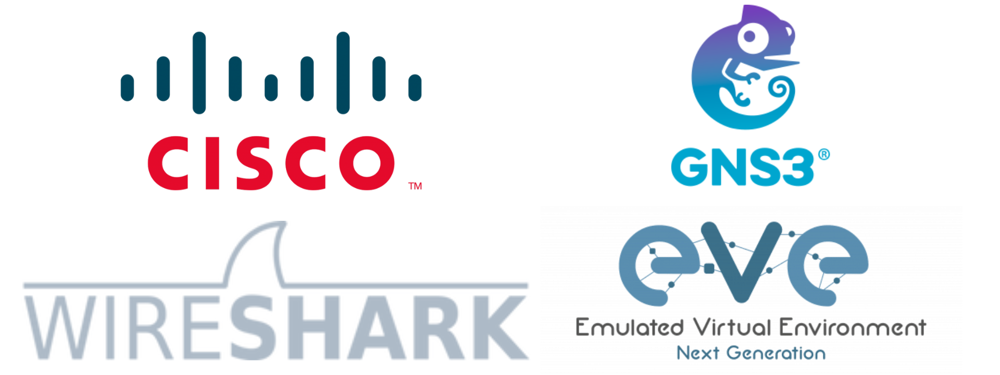

    

<h2 align="center">NDS Advanced GNS3 Projects (Sunny Sir - NDS Lab)</h2>

---

## 📝 About this project

Welcome to my **NDS Advanced GNS3 Projects Repository**, inspired by **Sunny Sir** and the **(NDS)** training.  
Here, you will find real-world Cisco GNS3 lab topologies and configurations simulating advanced enterprise and ISP-level networks. These labs are designed for CCNA, CCNP learners, and networking enthusiasts aiming to enhance hands-on skills using real Cisco IOS images in GNS3.

---

## 🧠 What's Inside?

- 🔧 Advanced GNS3 Topologies
- 📜 Pre-configured startup-config files
- 📚 Lab-by-lab configuration guides
- 🖼️ Screenshots of working topologies
- 🛠️ Real-world scenarios (ISP, MPLS, OSPF, BGP, VLAN, STP, etc.)
- 🧪 Troubleshooting labs

---

## 🚀 Who Can Use This?

- Students of **Sunny Sir (NDS)**
- CCNA/CCNP Aspirants **NG**
- Self-learners and Network Engineers
- Anyone building a home lab using GNS3

---

## 🚀 📁 Folder Structure Networking Labs

### [1. Basic OSPF Routing Lab with 5 Routers and 2 PCs](./Basic%20OSPF%20Routing%20Lab%20with%205%20Routers%20and%202%20PCs)

    

---

### [2. OSPF Multi Area Lab](./OSPF%20Multi%20Area%20Lab)

    

---

## 🧾 Lab Structure

Each lab includes:

- ✅ `.gns3project` file
- ✅ Topology diagram
- ✅ `startup-config` files
- ✅ Step-by-step guide or README
- ✅ Troubleshooting tips (where applicable)

---

## 📦 Tools & Requirements

- [GNS3](https://www.gns3.com/)
- Cisco IOS images (for routers/switches – use legally)
- [Wireshark](https://www.wireshark.org/)
- Basic knowledge of networking (CCNA level)

---

## 🙌 Credits

> Special thanks to **Sunny Sir** from **(NDS)** – Salute to the master of networking labs
> for his invaluable guidance and practical teaching approach 🙏

---

## 👨‍💻 About Me

- **Koushik Roy**  
- **GitHub**: [github.com/koushikroy99](https://github.com/koushikroy99)  
- **LinkedIn**: [linkedin.com/in/koushikroy99](https://www.linkedin.com/in/koushikroy99/)  
- **Twitter**: [x.com/koushikroyfx](https://x.com/koushikroyfx)  
- **Email**: koushikroy05042001@gmail.com  
- **Portfolio**: [koushikroy.in](https://www.koushikroy.in/)  

---

> 🔔 **Star** this repo if you find it helpful. Contributions and feedback are welcome!
